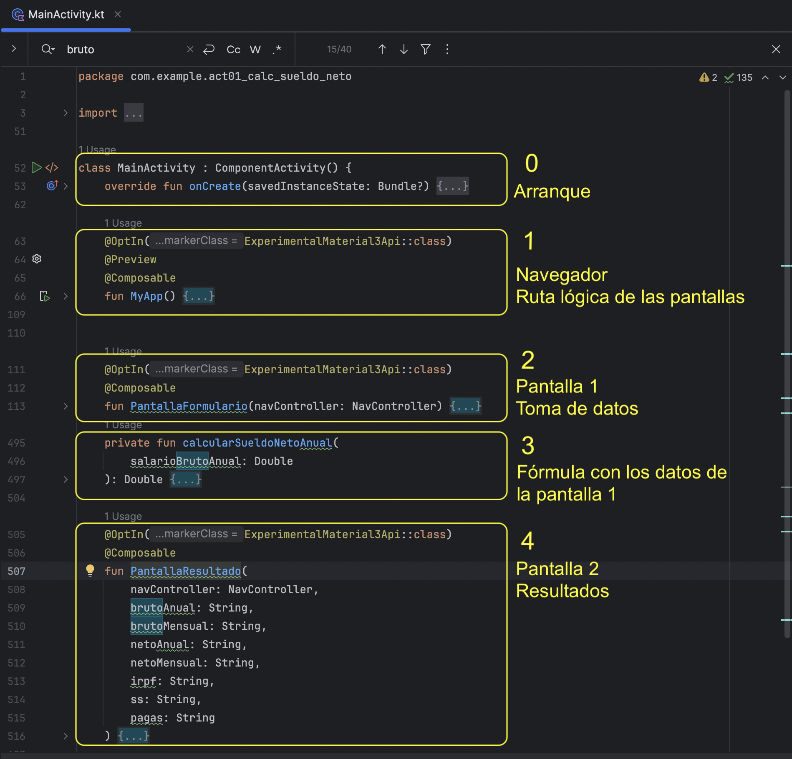

# Calculadora de Sueldo Neto (Actividad 1)

Aplicación Android desarrollada en **Kotlin + Jetpack Compose** para la Actividad 1 de la asignatura *Programación Multimedia y Dispositivos Móviles*.  
El objetivo es recoger una serie de datos personales y salariales del usuario, realizar un cálculo simulado del sueldo neto y mostrar el resultado en una segunda pantalla.

La aplicación está desarrollada bajo una **arquitectura de Actividad Única (Single-Activity)** y toda la lógica se encuentra en el fichero `MainActivity.kt`.

---

## Organización del Código

La estructura principal de la app se resume en los bloques de la imagen:



| Nº | Función / Bloque | Descripción |
|---:|------------------|-------------|
| 0  | `onCreate()`     | Arranque de la aplicación y aplicación del tema visual. |
| 1  | `MyApp()`        | Navegación. Define las rutas “formulario” y “resultado”. |
| 2  | `PantallaFormulario()` | Pantalla 1. Recoge los datos del usuario. |
| 3  | `calcularSueldoNetoAnual()` | Lógica del cálculo (simulada). |
| 4  | `PantallaResultado()` | Pantalla 2. Muestra los resultados. |

---

## ✨ Pantallas

### **1. PantallaFormulario() → Entrada de datos**
Esta pantalla recoge los datos que introduce el usuario:

- Edad  
- Grupo profesional (De 1 a 11)  
- Estado civil  
- Número de hijos  
- Grado de discapacidad  
- Salario bruto anual  
- Número de pagas (12 o 14)

He utilizado estados con `rememberSaveable` para conservar los valores aunque se rote la pantalla.
He usado TextField y ExposedDropdownMenuBox (desplegables) para recoger los datos.

Al pulsar **CALCULAR**:
1. Se valida que no haya campos vacíos.
2. Se valida que los valores numéricos sean correctos (`toDoubleOrNull()` / `toIntOrNull()`).
3. Si algo falla → se muestra un `AlertDialog`.
4. Si todo es correcto → se calculan bruto/ neto y deducciones.
5. Se navega a la pantalla de resultados pasando los valores por la ruta.

---

### **2. calcularSueldoNetoAnual() → Lógica del cálculo**
Esta función **no es un Composable**, es lógica pura y se ejecuta al pulsar el botón "CALCULAR". 
Con los datos necesarios aplica una simulación sencilla (no corresponde a tablas reales):

- Cotización Seguridad Social (SS): **7%**
- Retención IRPF estimada: **15%**

```kotlin
val sueldoTrasSS = salarioBrutoAnual * (1 - 0.07)
val sueldoNetoAnual = sueldoTrasSS * (1 - 0.15)
```

Se marca como **private** porque solo se utiliza desde PantallaFormulario() y no se necesita exponerla fuera de MainActivity.kt.

---

### **3. PantallaResultado() → Presentación**

Pantalla sin estado, cuya única responsabilidad es mostrar los valores calculados.

Los parámetros llegan como **String**, por lo que dentro de la función se convierten a Double para aplicar formato con dos decimales:

```kotlin
"%.2f".format(netoMensualDouble)
```

Esto permite evitar números muy largos con muchos decimales y mostrar el resultado de forma clara (por ejemplo, 1843.77 €).
